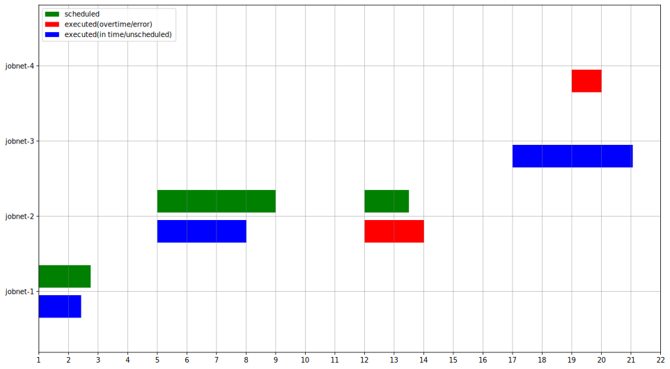

# jobtime

## Overview

jobtime is a tool to visualize job execution time for [Job Arranger](https://www.jobarranger.info/jaz/top.html).

## Features

- job execution times can be viewed at a glance
- colored by job status (success, failure, in time, overtime)

## Requirements

- Docker Engine
- Job Execution Log  
  - [JobArranger Manager GUI](https://www.jobarranger.info/document/doku.php?id=4.0:operation:management:08file)
  - [jobarg_joblogput command](https://www.jobarranger.info/jaz/operation-manual_2.0/10external-joblogput.html)
- Job Schedule (if needed)
  - [sample](resources/schedule.csv)

## Setup

To use jobtime, follow these steps:

1. Douwnload:

    ~~~bash
    git clone https://github.com/gtk7032/jobtime.git
    ~~~

1. Build the Docker image:

   ~~~bash
   docker compose build --build-arg UID=$(id -u) --build-arg GID=$(id -g)
   ~~~

   The UID and GID arguments will be assigned to the user used within the container.

1. Launch the container:

    ~~~bash
    docker compose up -d
    ~~~

## Usage

### Example

~~~bash
docker exec -it jobtime python src/main.py --joblog=joblog.csv 
# --> output/joblog.svg
~~~

### Required argument

| Parameter | Description                        |
| :-------- | :--------------------------------- |
| --joblog  | Path of the job execution log file |

### Optional arguments

| Parameter  | Default    | Description                                                      |
| :--------- | :--------- | :--------------------------------------------------------------- |
| --schedule |            | path of the job schedule file ([sample](resources/schedule.csv)) |
| --figsize  | 16:9       | width:height                                                     |
| --output   | joblog.svg | output file name                                                 |

## License

[MIT](https://choosealicense.com/licenses/mit/)

## Author

[gtk7032](https://github.com/gtk7032)
